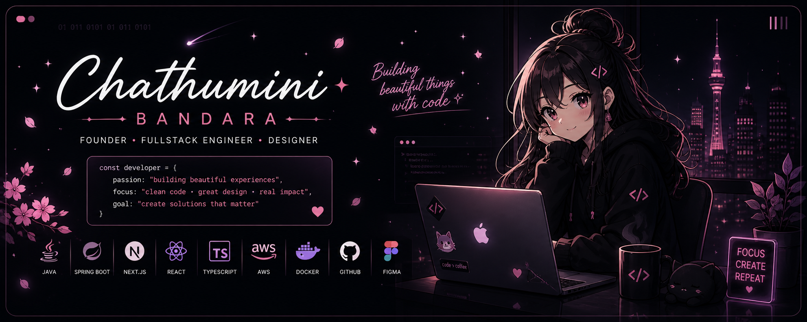
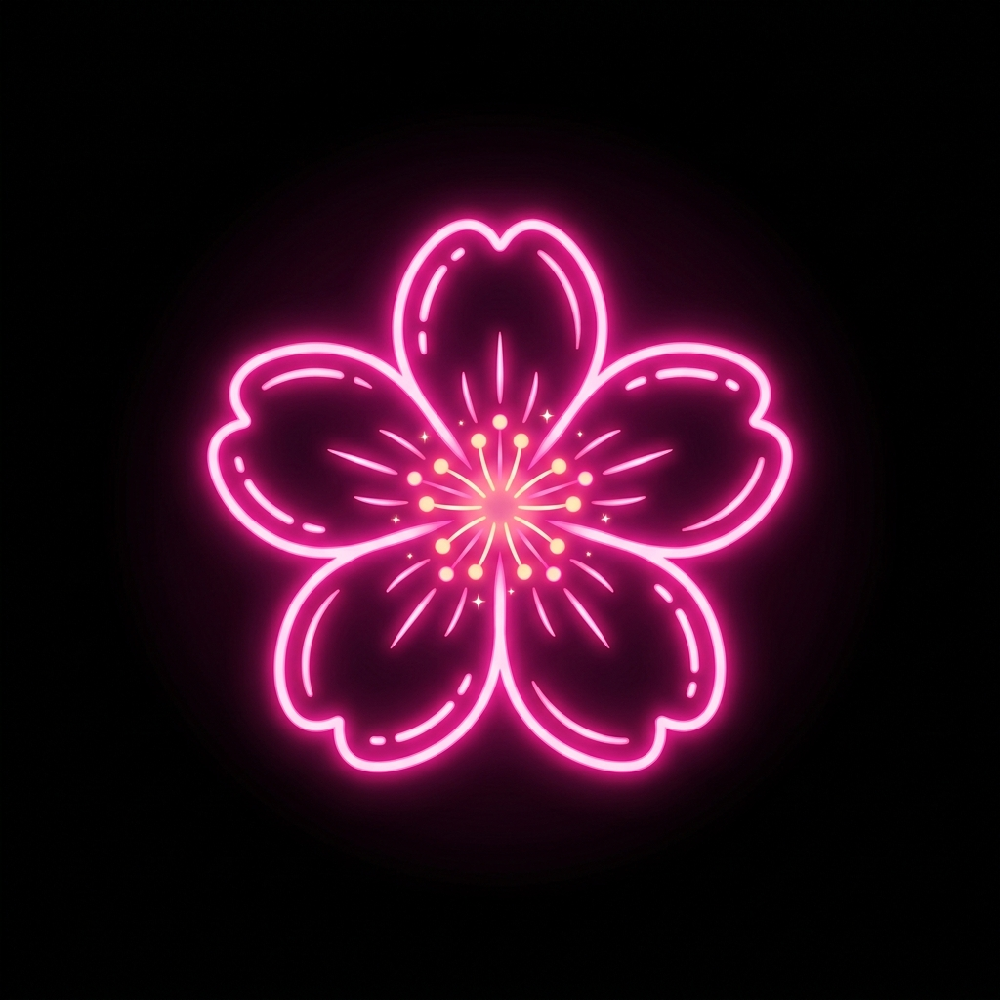
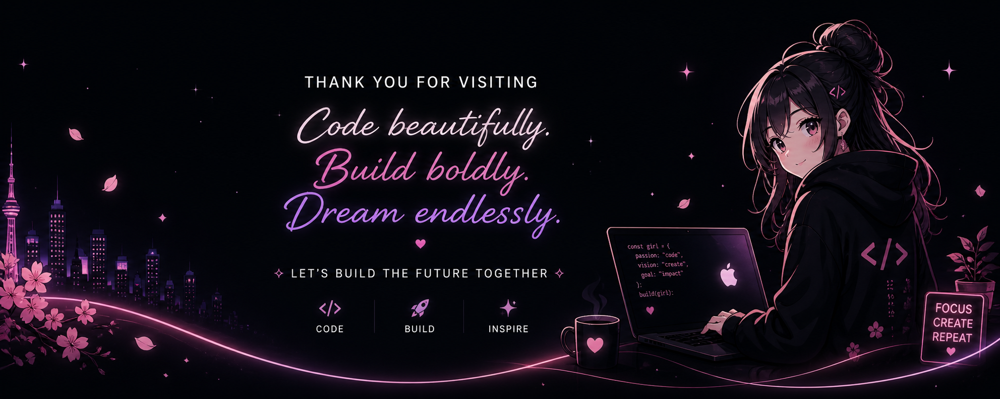

  

<!-- Stats Section -->

  
  
  

---

### Creating beautiful things through code ✦

I’m **Chathumini Bandara** —  
a passionate **Fullstack Engineer + Designer** from **Sri Lanka 🇱🇰**

I love building products that combine:

**Elegant Design** ✦ **Scalable Architecture** ✦ **Meaningful UX**

 

> *"Clean code. Great design. Real impact."*

✦ ──────────────────────────────────────────────────── ✦

<h2 align="center">
   Featured Projects
</h2>
<table align="center">
<tr>
<td width="50%" valign="top">
  <h3>🧠 AI Tutor Platform</h3>
  
AI-powered learning platform with smart assessments, feedback & analytics.

  <code>Next.js</code> <code>AI</code> <code>Tailwind</code>
</td>
<td width="50%" valign="top">
  <h3>🎥 OTT Streaming Platform</h3>
  
Scalable video streaming platform with live streaming, VOD & secure playback.

  <code>Java</code> <code>Spring Boot</code> <code>AWS</code>
</td>
</tr>
<tr>
<td width="50%" valign="top">
  <h3>☁️ AWS Mail Infrastructure</h3>
  
Production-grade email infrastructure with SES, Route53, IAM, S3 & CloudFront.

  <code>AWS</code> <code>Docker</code> <code>Terraform</code>
</td>
<td width="50%" valign="top">
  <h3>🎨 UI/UX Design System</h3>
  
Design system and modern UI components for beautiful and consistent user experiences.

  <code>Figma</code> <code>UI/UX</code> <code>Design</code>
</td>
</tr>
</table>

✦ ──────────────────────────────────────────────────── ✦

<h2 align="center">
   Connect With Me
</h2>

  

